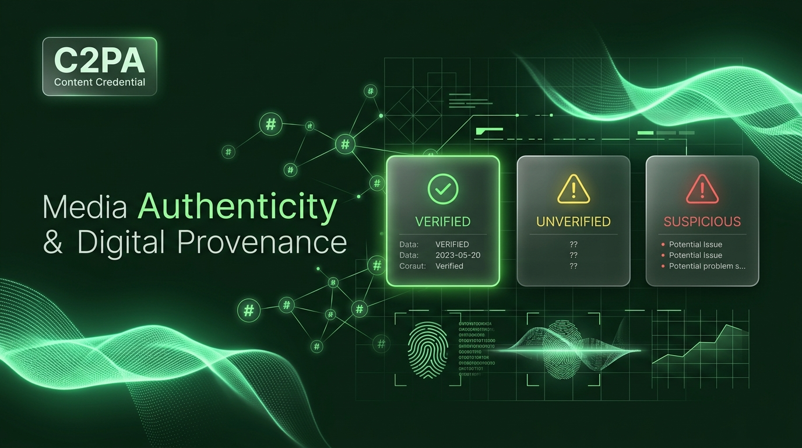
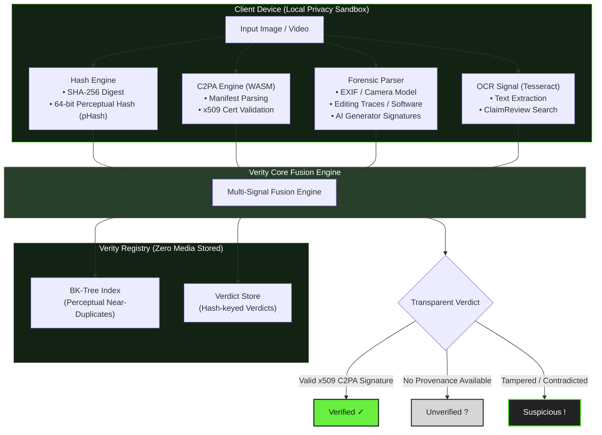
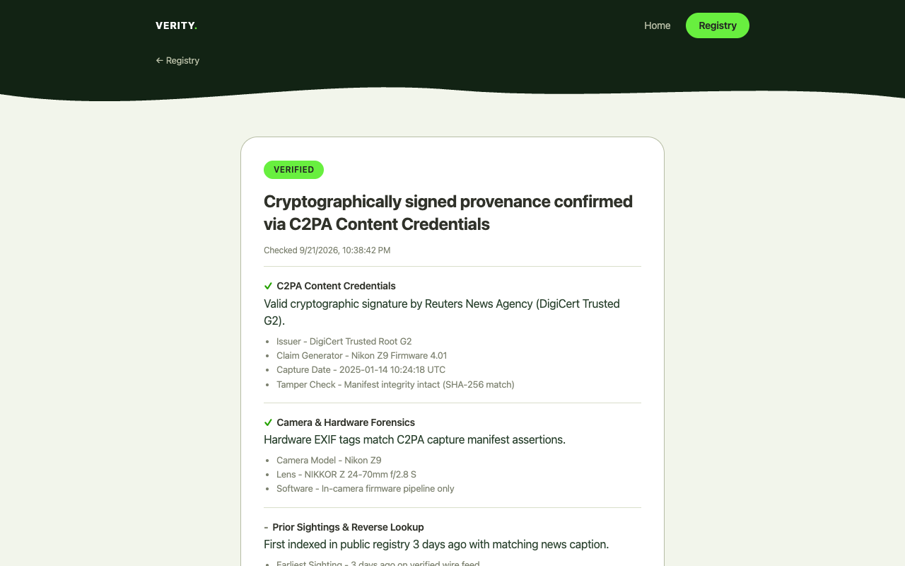
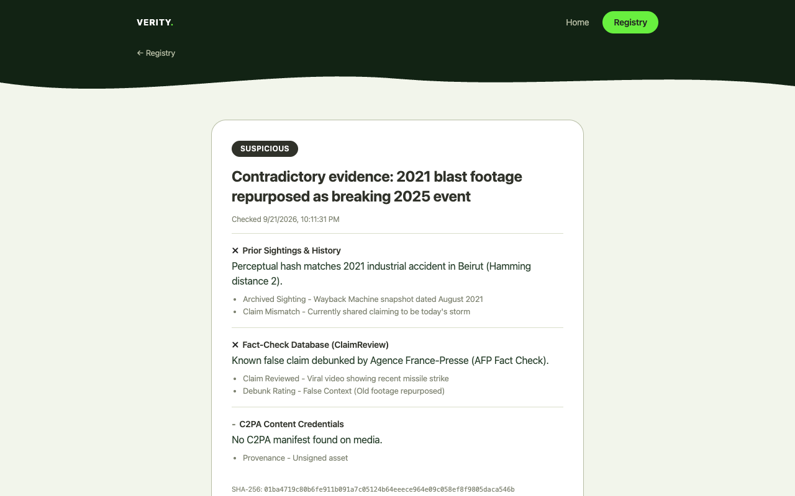
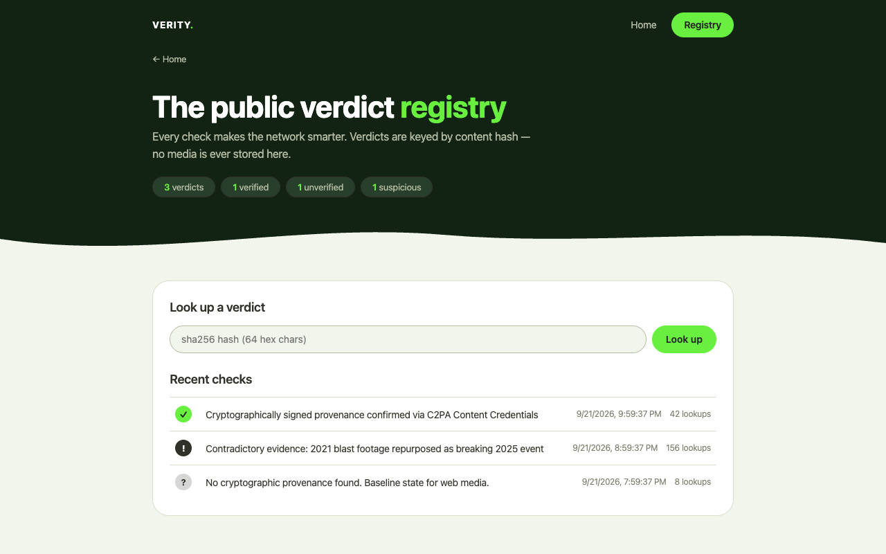

<div align="center">

# Verity: Multi-Signal Media Authenticity Engine

<p align="center">
  <strong>Cryptographic Provenance (C2PA) &bull; Perceptual Hashing (pHash BK-Tree) &bull; Metadata Forensics &bull; Zero-Telemetry Privacy</strong>
</p>

[](https://github.com/mintahandrews/verity/actions/workflows/ci.yml)
[](LICENSE)
[](https://c2pa.org/)
[](https://www.typescriptlang.org/)
[](packages/extension)
[](https://t.me/CheckVerityBot)
[](CONTRIBUTING.md)

<br />



</div>

---

## What is Verity?

**Verity is an open-source, multi-signal media authenticity engine.** 

Traditional AI detectors attempt to answer *"is this fake?"* using probabilistic classifiers that suffer from severe false-positive rates on real camera photos and easily break against basic compression. Verity fundamentally reframes media analysis:

> **We don't ask *"is this fake?"* &mdash; we ask *"what can we verify?"***

Most viral misinformation on the modern web is not a generative deepfake &mdash; it is **authentic media presented with fabricated context** (*cheapfakes*), recycled war footage, or miscaptioned screenshots. Verity investigates media across multiple deterministic evidence signals and produces a transparent, evidence-backed verdict:

| Verdict | Definition | Visual Indicator |
| :--- | :--- | :---: |
| **`Verified`** | Cryptographically signed provenance confirmed (C2PA Content Credentials). Only valid cryptographic certificate chains can verify origin. | `✓` |
| **`Unverified`** | No cryptographic provenance found. This is the normal baseline for most digital media &mdash; it means origin cannot be proven, **not** that it is false. | `?` |
| **`Suspicious`** | Concrete evidence contradicts claims (tampered signature, prior sightings under contradictory context, or debunked fact-checks). | `!` |

Verity **never** outputs the word *"fake"*. Every verdict displays the underlying evidentiary chain so humans can inspect the proof themselves.

---

## Key Features & Capabilities

- 🛡️ **C2PA Content Credentials**: Parses and validates tamper-evident C2PA manifests and x509 certificates locally inside a browser WASM sandbox.
- ⚡ **Perceptual Hash BK-Tree Index**: Ultra-fast Burkhard-Keller metric tree for hamming distance lookups (16-char hex pHash) catching crops, resizes, and compression variations.
- 🔍 **Metadata Forensics**: Extracts camera EXIF, software editing footprints, AI-generator signatures (e.g. Midjourney, DALL-E, Stable Diffusion tags), and cross-checks GPS vs. claimed geolocation.
- 📰 **Newsroom Fact-Check Matching**: Local Tesseract OCR extracts text from memes, headlines, and screenshots, cross-referencing ClaimReview databases and GDELT global news index.
- 🌤️ **Context Cross-Checks**: Daylight plausibility (sun position from EXIF GPS + time, computed on-device), recorded weather vs. caption claims via the Open-Meteo archive, Wikimedia Commons SHA-1 prior-sighting, and source-domain age via RDAP.
- ⏱️ **Timestamp-Anchored Verdicts**: Registry records are stamped to a public OpenTimestamps calendar — hash-only, tamper-evident, and later upgradable to a Bitcoin-anchored proof.
- 🔒 **Zero-Telemetry Privacy**: Your photos and videos **never** leave your machine. Decoding and forensic parsing happen client-side. The registry API receives only SHA-256 and pHash fingerprints.
- 🌐 **Chrome / Firefox Extension (Manifest V3)**: Inspect any image on the web via right-click context menu or toolbar popup.
- 🤖 **Telegram Verification Bot**: Forward photos or videos to [`@CheckVerityBot`](https://t.me/CheckVerityBot) for immediate analysis and shareable verdict links.
- 🖋️ **C2PA Signer CLI ("Prove Real")**: Photographers, journalists, and creators can locally stamp their original media with signed C2PA manifests before publishing.

---

## Architecture Flow



---

## Interface Previews & Real Screenshots

<table align="center" width="100%">
  <tr>
    <td width="50%" align="center">
      <strong>Verified Verdict (C2PA Provenance)</strong><br />
      
    </td>
    <td width="50%" align="center">
      <strong>Suspicious Verdict (Contradictory Context)</strong><br />
      
    </td>
  </tr>
  <tr>
    <td width="50%" align="center">
      <strong>Public Registry Landing &amp; FAQ</strong><br />
      
    </td>
    <td width="50%" align="center">
      <strong>Newsroom Forensic Dashboard</strong><br />
      
    </td>
  </tr>
</table>

---

## Monorepo Packages

Verity is architected as an ultra-fast TypeScript monorepo using npm workspaces:

| Package | Path | Description |
| :--- | :--- | :--- |
| **`@verity/core`** | [`packages/core`](packages/core) | Pure TypeScript engine: signal registry, fusion logic, forensic rules, fact-check connectors. Zero DOM dependencies. |
| **`@verity/extension`** | [`packages/extension`](packages/extension) | Chrome & Firefox Manifest V3 extension: offscreen WASM analysis, context menu, popup, in-page badge overlays. |
| **`@verity/registry`** | [`packages/registry`](packages/registry) | Zero-dependency verdict API server (`node:http`): BK-tree pHash index, `/v/:sha256` share pages, newsroom dashboard, SEO/GEO metadata. |
| **`@verity/bot`** | [`packages/bot`](packages/bot) | Production Telegram bot (`grammY` + `sharp`) verifying media on mobile with zero user setup. |
| **`@verity/signer`** | [`packages/signer`](packages/signer) | Local C2PA signing tool for creators to cryptographically sign their originals. |

---

## Quickstart

### Prerequisites

- **Node.js**: 24.x (required - the registry and bot run TypeScript via Node strip-types)
- **npm**: >= 10.x

### 1. Installation

Clone the repository and install workspace dependencies:

```bash
git clone https://github.com/mintahandrews/verity.git
cd verity
npm install
```

Verify your setup:
```bash
npm run typecheck   # Typecheck all packages
npm test            # Run Vitest test suites across workspaces
```

---

### 2. Browser Extension (Chrome & Firefox)

Build the extension with Vite:

```bash
npm run build       # Production bundle to packages/extension/dist
# Or for live development with HMR:
npm run dev
```

**Load the extension in Chrome:**
1. Open Google Chrome and go to `chrome://extensions/`.
2. Enable **Developer mode** (toggle in upper right).
3. Click **Load unpacked** and select `packages/extension/dist`.
4. Right-click any image on the web &rarr; click **"Verify with Verity"**.

To package a zip for Chrome Web Store distribution:
```bash
npm run pack        # → release/verity-extension.zip
```

---

### 3. Verdict Registry Server & Dashboard

Start the zero-dependency verdict server:

```bash
npm run registry
```

- Public Landing Page & FAQ: `http://localhost:8787/`
- Live Newsroom Dashboard: `http://localhost:8787/dashboard`
- Healthcheck: `http://localhost:8787/healthz`
- Generative Engine Optimization Spec: `http://localhost:8787/llms.txt`

#### Key API Endpoints

```bash
# Query verdict by SHA-256 hash
curl http://localhost:8787/api/verdicts/<sha256-hex>

# Query perceptual near-duplicates (pHash Hamming distance <= 8)
curl "http://localhost:8787/api/similar?phash=a1b2c3d4e5f67890&maxdist=8"

# Public verification statistics
curl http://localhost:8787/api/stats
```

---

### 4. Telegram Bot

Run the bot locally or on a server:

```bash
TELEGRAM_BOT_TOKEN="<your-token-from-BotFather>" npm run bot
```

Forward any photo or video to your bot &mdash; it analyzes the media in-process and returns the verdict with a shareable verification link.

**Optional Environment Variables:**
- `REGISTRY_URL`: URL of your registry server (defaults to `http://localhost:8787`)
- `FACT_CHECK_API_KEY`: Google Fact Check Tools API key for ClaimReview queries
- `OCR`: Set to `0` to disable text extraction (default: `1`)
- `RATE_LIMIT_MAX`: Requests per user window (defaults to `30`)

---

### 5. Signer CLI ("Prove Real")

Embed authentic C2PA Content Credentials into your original files before publishing:

```bash
# Production signing with real x509 credentials
npm run sign -- photo.jpg signed.jpg --cert cert.pem --key key.pem

# Ephemeral test certificate (development only)
npm run sign -- photo.jpg signed.jpg --test
```

---

### 6. Newsroom Bulk Intake Tool

Process a folder of incoming media from the field:

```bash
node packages/bot/src/scan.ts /path/to/media/folder --out newsroom-report
```
Generates `newsroom-report.csv` and `newsroom-report.json` with SHA-256, pHash, forensic indicators, and shareable links for every asset.

---

## Production Deployment (Railway)

A live public registry is hosted at:
👉 **[https://verity.codemintah.dev](https://verity.codemintah.dev)**

Live Telegram bot:
👉 **[@CheckVerityBot](https://t.me/CheckVerityBot)**

To deploy your own instance to Railway:
```bash
railway up -s registry -d
```
Mount a persistent volume at `/data` and set `VERITY_DB=/data/registry.json`, or provision the Railway Postgres plugin and set `DATABASE_URL=${{Postgres.DATABASE_URL}}` — the registry auto-selects Postgres when `DATABASE_URL` is present, migrates any existing JSON records on first boot, and falls back to the JSON store if Postgres is unreachable.

---

## Search & Discovery Topics

`c2pa` &bull; `content-credentials` &bull; `media-authenticity` &bull; `deepfake-detection` &bull; `digital-forensics` &bull; `perceptual-hashing` &bull; `bk-tree` &bull; `disinformation-countermeasures` &bull; `misinformation-mitigation` &bull; `fact-checking` &bull; `chrome-extension` &bull; `manifest-v3` &bull; `epistemic-security` &bull; `zero-telemetry` &bull; `open-source`

---

## Community & Contributing

We welcome contributions from open-source developers, digital forensic experts, journalists, and security researchers!

- 📖 **Contributor Guidelines**: Read our [CONTRIBUTING.md](CONTRIBUTING.md) to learn how to add new verification signals.
- 📜 **Code of Conduct**: We adhere to the [Contributor Covenant v2.1](CODE_OF_CONDUCT.md).
- 🔒 **Security Policy**: Read [SECURITY.md](SECURITY.md) to report vulnerabilities privately.
- 🎓 **Citation**: Using Verity in research? See [CITATION.cff](CITATION.cff).

---

## License

Licensed under the **Apache License, Version 2.0**. See [LICENSE](LICENSE) for details.

Verdict icon animations (`verified`, `unverified`, `suspicious`, `loading`) are
"checkmark", "help", "alertTriangle", and "loading" by
[useAnimations](https://useanimations.com), licensed
[CC-BY 4.0](https://creativecommons.org/licenses/by/4.0/) and recolored to the
Verity palette. The `sprout` animation is "plant-item" by svgenius via
[LottieFiles](https://lottiefiles.com), used under the Lottie Simple License.
