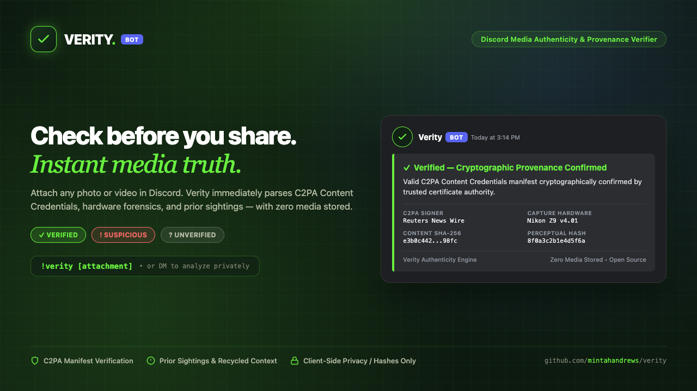

# @checkverity/bot

> High-throughput Telegram & Discord verification bot for Verity, powered by grammY and sharp.

[](../../LICENSE)
[](https://t.me/CheckVerityBot)
[](src/discord.ts)

<br />



`@checkverity/bot` brings instant media verification directly to chat apps (Telegram & Discord) where misinformation spreads fastest. Users forward viral images or videos to [`@CheckVerityBot`](https://t.me/CheckVerityBot) or use `!verity` in Discord to receive an instant evidence-backed verdict.

---

## Capabilities

- 🤖 **Instant Forward Analysis**: Users forward images or video frames directly from private or group chats.
- ⚡ **Multi-Signal Extraction**: Extracts C2PA manifests (via `c2pa-node`), EXIF metadata, camera footprints, and perceptual hashes.
- 🔗 **Shareable Verdict Links**: Automatically generates public registry permalinks for newsroom distribution.
- 🛡️ **Sliding-Window Rate Limiting**: In-memory token bucket prevents spam while preserving high responsiveness.

---

## Configuration

Set the following environment variables:

```bash
# Telegram Bot Token from @BotFather
export TELEGRAM_BOT_TOKEN="your_telegram_bot_token_here"

# Discord Bot Token from Discord Developer Portal -> Bot
export DISCORD_BOT_TOKEN="your_discord_bot_token_here"

# Registry API endpoint (optional, defaults to http://localhost:8787)
export REGISTRY_URL="https://verity.codemintah.dev"
```

---

## Running Locally

```bash
# Install dependencies
npm install

# Start Telegram Bot
npm start -w @checkverity/bot

# Start Discord Bot
npm run start:discord -w @checkverity/bot
```

---

## License

Apache-2.0 &copy; [Andrews Mintah](https://github.com/Mintahandrews)
